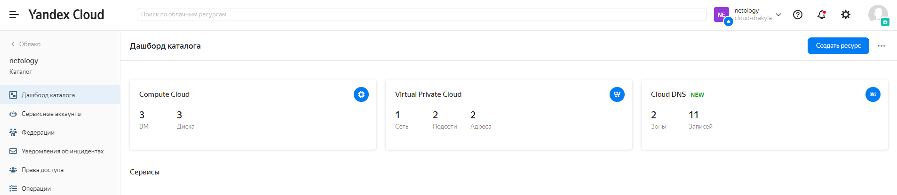
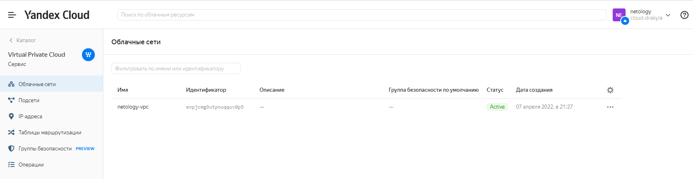
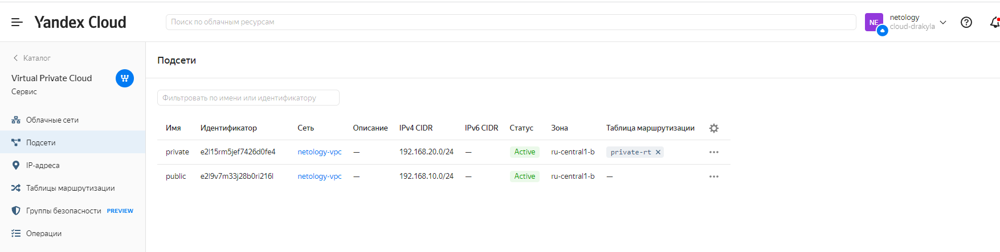
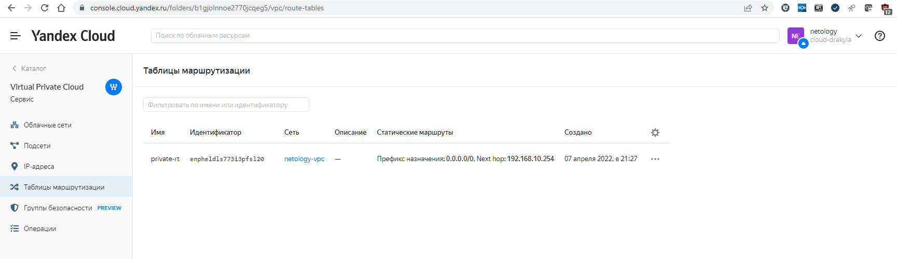
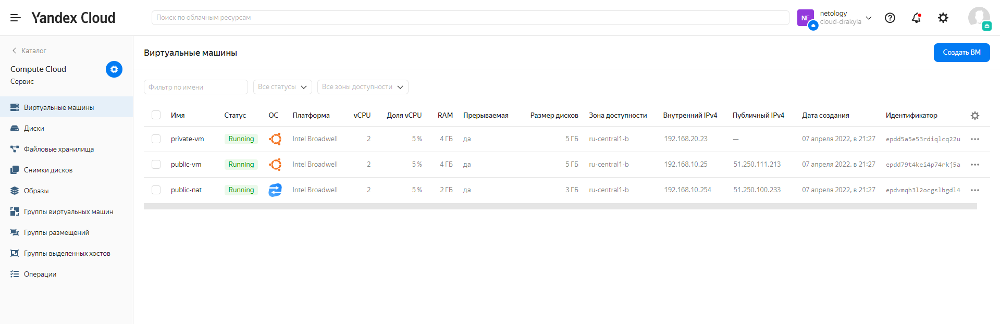

# 15.1. Организация сети
1. Яндекс.Облако
  - Конфигурация terraform лежит в папке [netology-yc](./netology-yc/);
  - Переменные не прятал, лежат в файле [terraform.tfvars](./netology-yc/terraform.tfvars);
  - Переменная token задается в переменной окружения заранее, для Windows PowerShell комманда `$env:TF_VAR_yc_token = yc iam create-token` (должно быть настроенное Yandex CLI);
  - Вывод комманды `terraform plan` [terraform-plan.log](./terraform-plan.log);
  - Вывод комманды `terraform apply` [terraform-apply.log](./terraform-apply.log);
  - Скриншоты после применения;
    __Консоль__
    
    __VPC__
    
    __Subnet__
    
    __Routing table__
    
    __VM__
    
  - Проверка с машины public-vm:
    ``` bash
    # IP текущей машины
    grayfix@epdd79t4kei4p74rkj5a:~$ ip a | grep 192.168
    inet 192.168.10.25/24 brd 192.168.10.255 scope global eth0

    # Проверяем внешний IP адрес с icanhazip.com
    grayfix@epdd79t4kei4p74rkj5a:~$ curl icanhazip.com
    51.250.111.213

    #Совпадает с public-vm_ip = "51.250.111.213"
    ```
  - Проверка с машины private-vm:
    ``` bash
    # Подключаемся к private-vm с машины public-vm
    grayfix@epdd79t4kei4p74rkj5a:~$ ssh grayfix@192.168.20.23
    Enter passphrase for key '/home/grayfix/.ssh/id_rsa':
    Welcome to Ubuntu 20.04.4 LTS (GNU/Linux 5.4.0-107-generic x86_64)

    # IP текущей машины
    grayfix@epdd5a5e53rdiqlcq22u:~$ ip a | grep 192.168
        inet 192.168.20.23/24 brd 192.168.20.255 scope global eth0

    # Проверяем внешний IP адрес с icanhazip.com
    grayfix@epdd5a5e53rdiqlcq22u:~$ curl icanhazip.com
    51.250.100.233

    #Совпадает с public-nat_ip = "51.250.100.233"
    ```

2. Сделать в AWS не могу, старую учетку заблокировали. Требовали какую-то расширенную валидацию. Создать новую или возобновить старую не представляется возможным в текущей ситуации. 