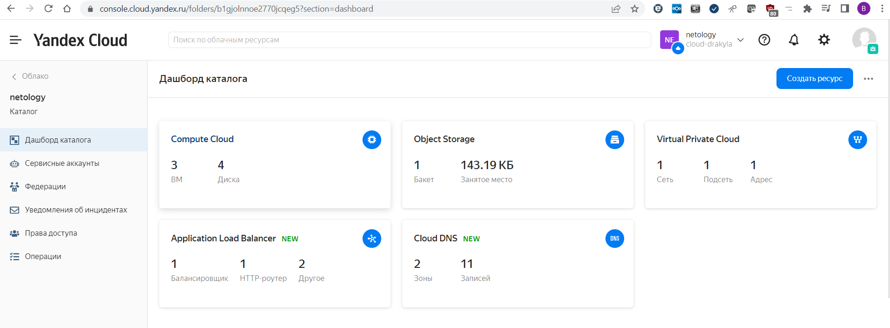
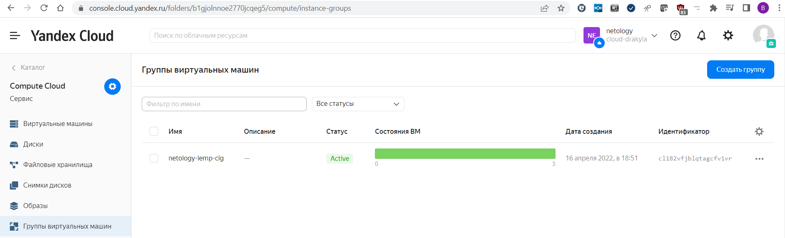
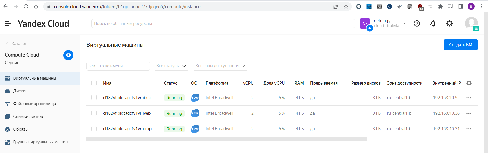
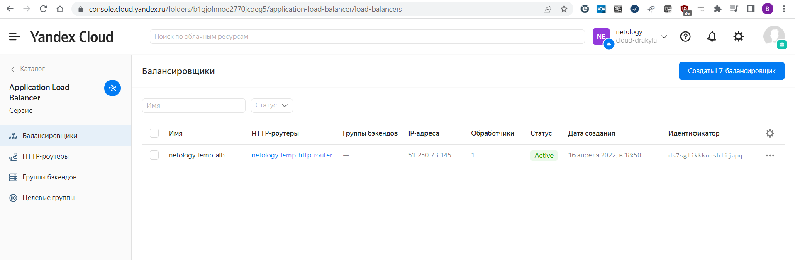
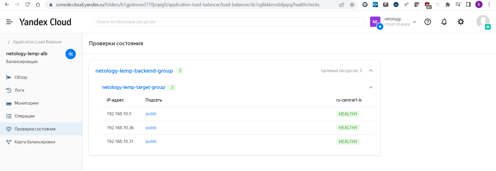
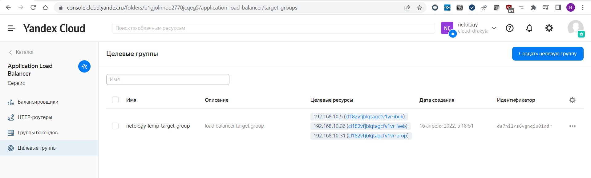
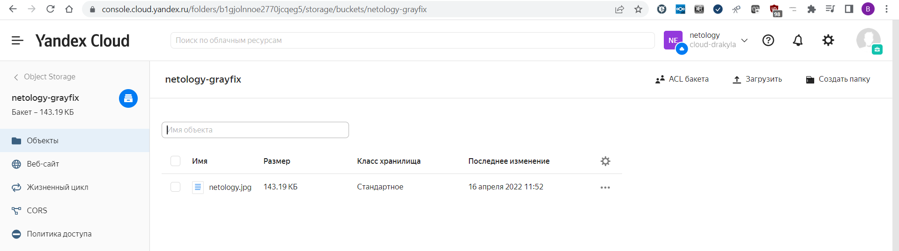
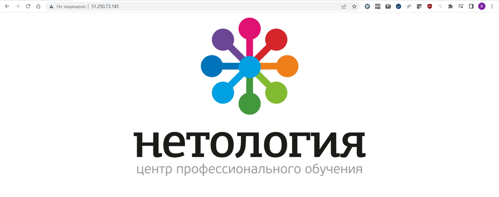

# 15.2 Вычислительные мощности. Балансировщики нагрузки
1. Yandex Cloud
  - Конфигурация terraform лежит в папке [netology-yc](./netology-yc/);
  - Переменные не прятал, лежат в файле [terraform.tfvars](./netology-yc/terraform.tfvars);
  - Переменная token задается в переменной окружения заранее, для Windows PowerShell комманда `$env:TF_VAR_yc_token = yc iam create-token` (должно быть настроенное Yandex CLI);
  - Вывод комманды `terraform apply` [terraform-apply.log](./terraform-apply.log);
  - Предлодженный в задании образ LAMP работает как-то нестибльно. Состояние в группе размещения мониторится нормально, а балансировщик приложений L7 его не может проверить. В логах компьютера 400 ошибка от запросов проверки здоровья балансировщика. Переделал все на образ LEMP fd89p7c1733dg28ssvev. Сразу нормально заработали проверки;
  - Ссылка на картинку в бакете - [https://storage.yandexcloud.net/netology-grayfix/netology.jpg](https://storage.yandexcloud.net/netology-grayfix/netology.jpg);
  - Страничка для показа передается при создании ВМ через файл [auth-meta.txt](./netology-yc/auth-meta.txt);
  - Скриншоты после создания:
    __Консоль__
    
    __Группы виртуальных машин__
    
    __Виртуальные машины в группе__
    
    __Балансировщик приложений L7__
    
    __Раздел проверки состояния в настройках балансировщика__
    
    __Целевая группа__
    
    __Бакет в объектом хранилище__
    
    __Получившийся сайт__
    

2. В AWS сделать не могу в текущих условиях.