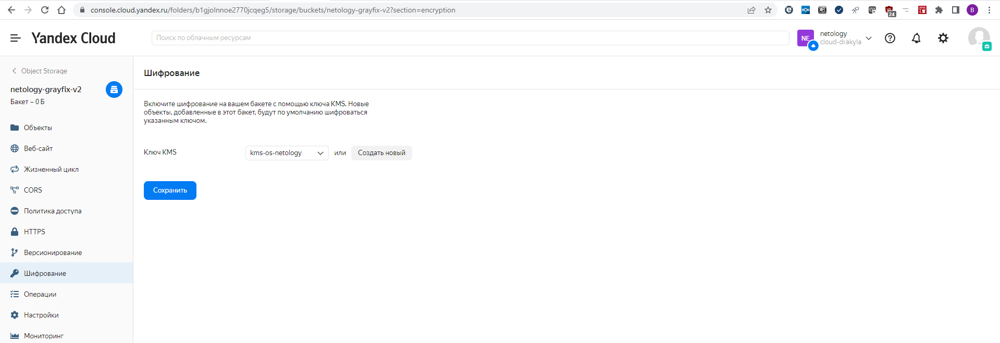
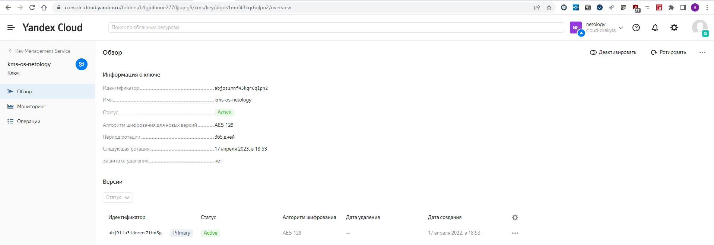
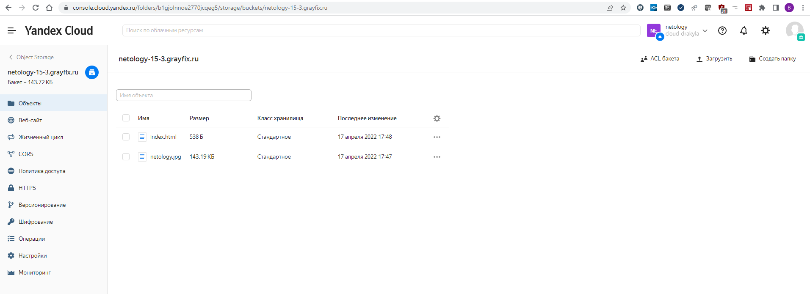
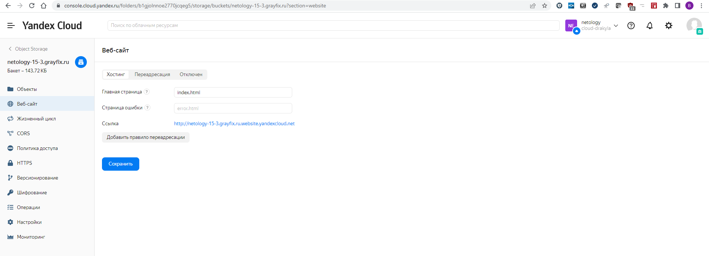
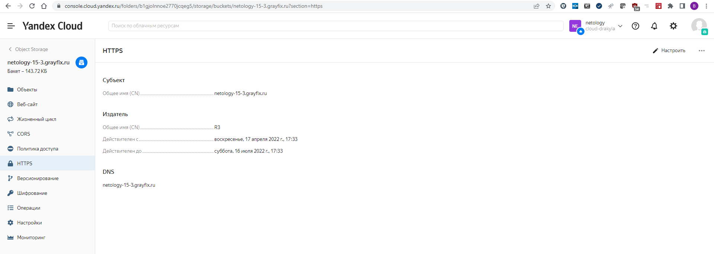
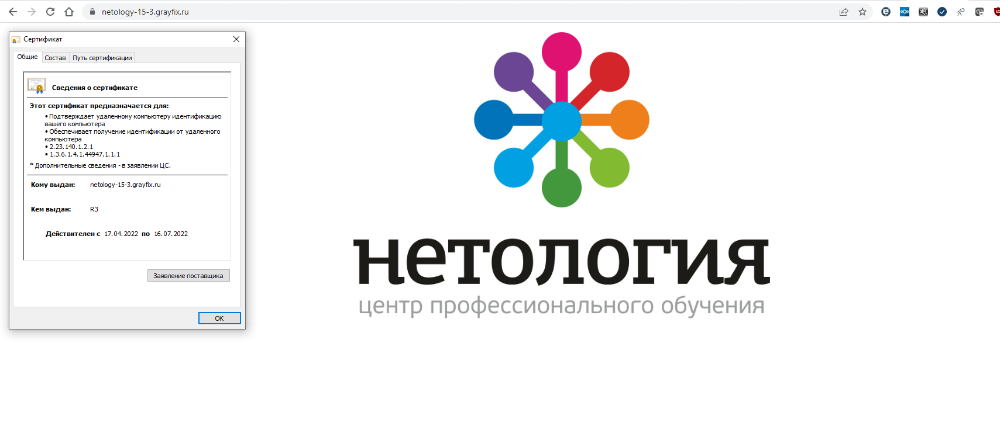

# 15.3 "Безопасность в облачных провайдерах"
1. Yandex Cloud
  - Шифрованный бакет:
    - Зашифровать текущий бакет вариантов не нашел. Terraform пытается создать новый бакет и ругается на уже созданный. Также, при ручном применении шифрования на бакет пишется что шифроваться будут только новые файлы. 
    - Конфигурация terraform лежит в папке [netology-yc](./netology-yc/);
    - Переменные не прятал, лежат в файле [terraform.tfvars](./netology-yc/terraform.tfvars);
    - Переменная token задается в переменной окружения заранее, для Windows PowerShell команда `$env:TF_VAR_yc_token = yc iam create-token` (должно быть настроенное Yandex CLI);
    - Вывод команды `terraform apply` [terraform-apply.log](./terraform-apply.log);
    - Скриншоты после создания:
        __Бакет__
        
        __Ключ__
        
  
  - Скриншоты настройки статического сайта
    __Содержимое бакета__
    
    __Настройки WEB сайта__
    
    __Настройки сертификата__
    
    __Вид сайта__
    
