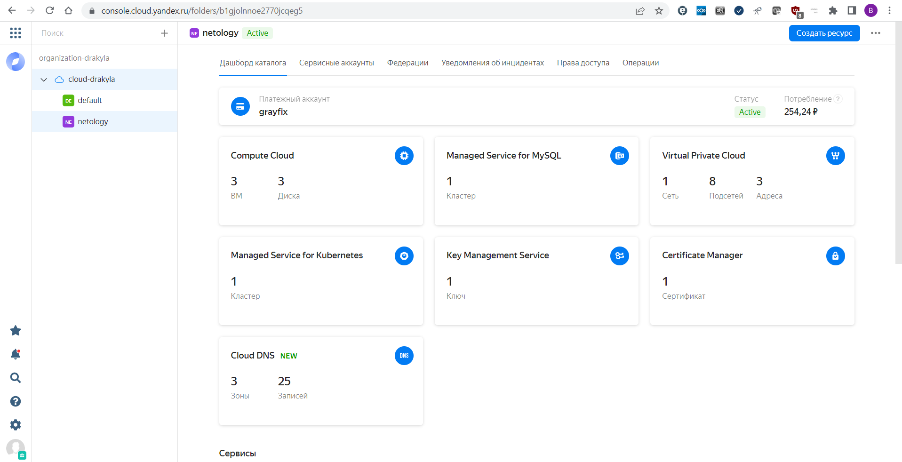
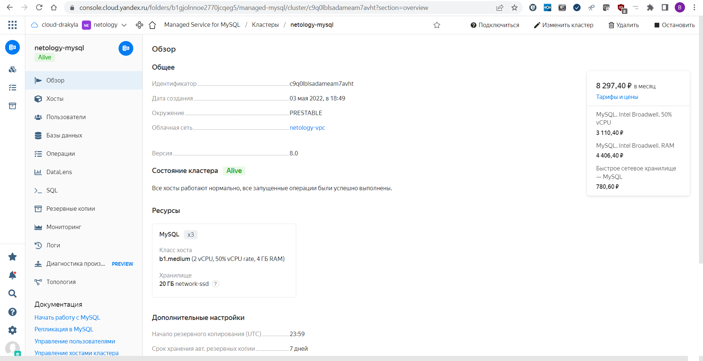
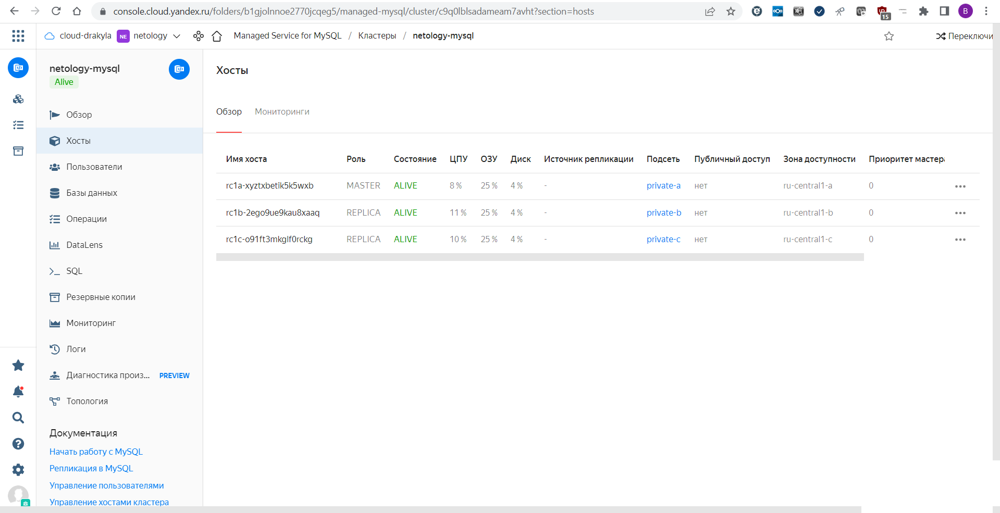
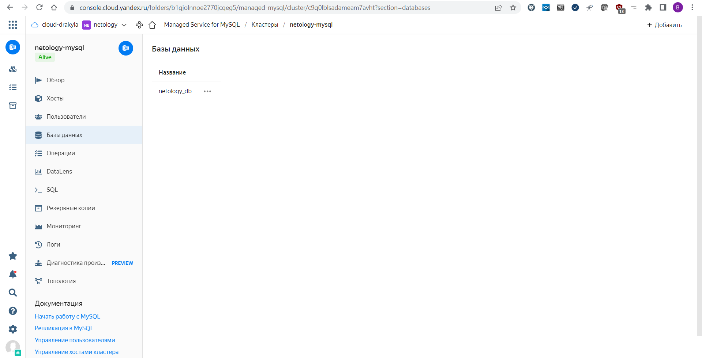
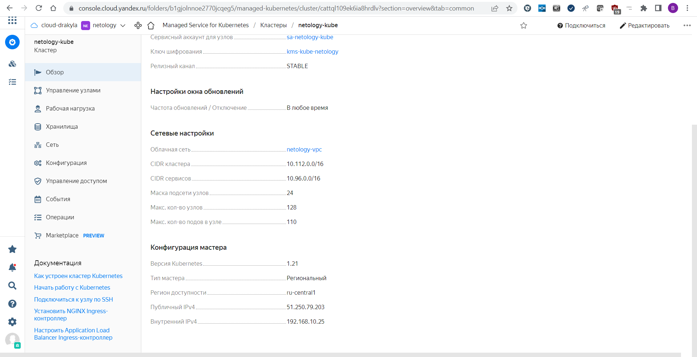
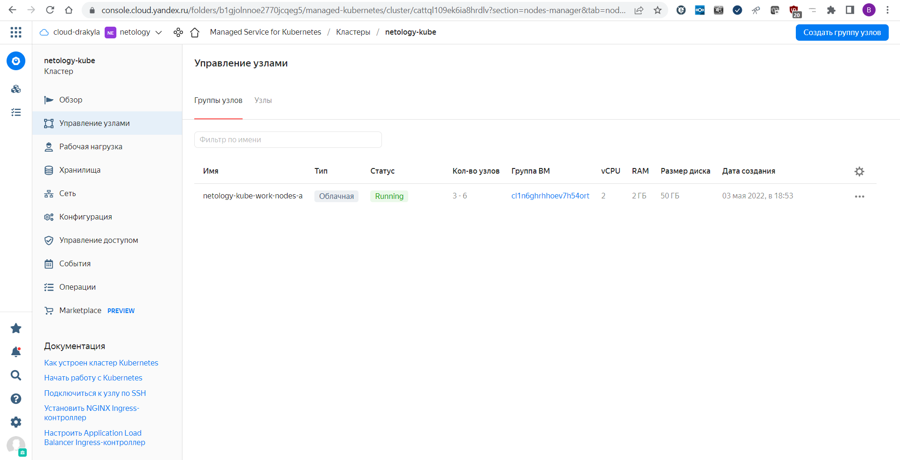
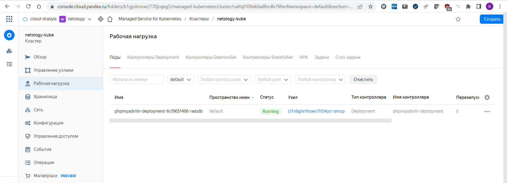
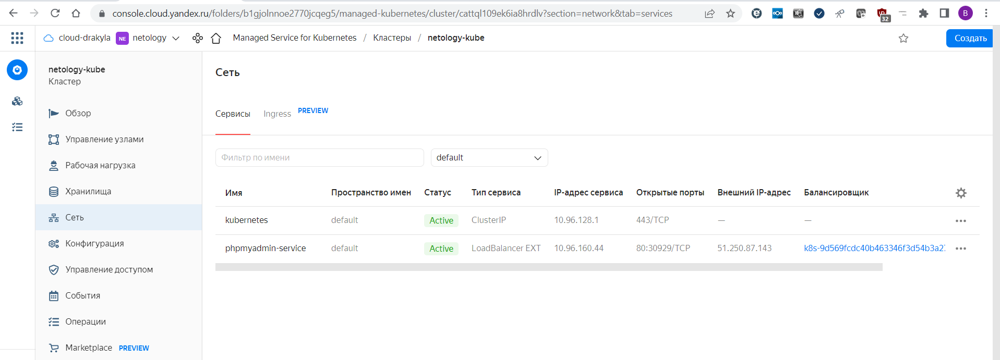

# 15.3 "Безопасность в облачных провайдерах"
1. Yandex Cloud
  - Общее: 
    - Конфигурация terraform лежит в папке [netology-yc](./netology-yc/);
    - Переменные не прятал, лежат в файле [terraform.tfvars](./netology-yc/terraform.tfvars);
    - Переменная token задается в переменной окружения заранее, для Windows PowerShell команда `$env:TF_VAR_yc_token = yc iam create-token` (должно быть настроенное Yandex CLI);
    - Вывод команды `terraform apply` [terraform-apply.log](./terraform-apply.log);
    - Пароль для БД указан в файле terraform.tfvars, в продуктовой среде нужно спрятать куда-то. Например, в vault;
    - После применения выводится адрес хоста MySQL и команда для настройки конфигурации kubernetes;
      ```
      Outputs:

        kubectl_init = "kubectl init kommand: yc managed-kubernetes cluster get-credentials --id cattql109ek6ia8hrdlv --external"
        mysql_host_address = "MySQL host: rc1a-xyztxbetik5k5wxb.mdb.yandexcloud.net"
      ```
  - Консоль облака
    
  - Скриншоты части MySQL
    __Консоль__
    
    __Распределение хостов MySQL__
    
    __Список БД__
    

  - Скриншоты части Kubernetes
    __Консоль__
    
    __Настройки рабочих нод__
    
    __Список подов__
    
    __Список сервисов__
    

  - phpMyAdmin
    - Манифест для деплоя [deploy.yaml](./phpmyadmin/deploy.yaml)
    - Перед применением изменить хост mysql на выданный терраформом. Логин и пароль на сам сервис лучше спрятать получше.

